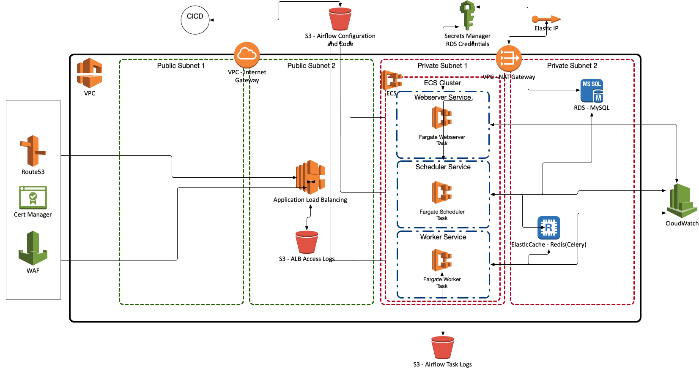

# What is this?

**THIS IS A WIP**

**Since mounting a file system is difficult and I'm against running supervisor in a container to run cron(and copy dags over), I'm working on another solution besides restarting all the containers when I deploy new dags.**

**Maybe I can copy the dags from S3 onto the containers using airflow itself.  Hmm**

This is the terraform code to create the following airflow architecture.

**tf_s3_state** 

- directory contains the terraform code to create an s3 bucket to store the terraform state for the terraform code in the other directory.

**tf_new_net_rds_ec_fg**

- directory contains the terraform code to create the complete AWS airflow stack.

**Please refer to https://github.com/turnerlabs/airflow_stack_aws_fg_image for creating the AMI's that run in this stack.**
